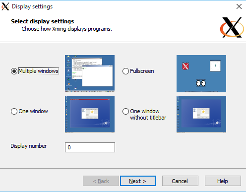
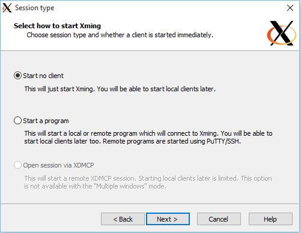
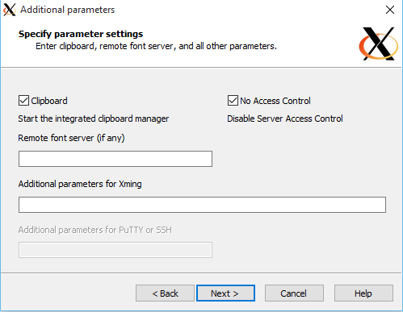
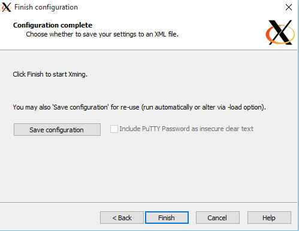

##### Install Xming
Xming is a x server available for windows. In this example we'll use it to run a linux application in a docker container and output the X data to the host machine (running Windows).

Start by downloading xming from `http://sourceforge.net/projects/xming/`

##### Configure Xming
After installing, run `xlaunch.exe` and configure it as the images below:

